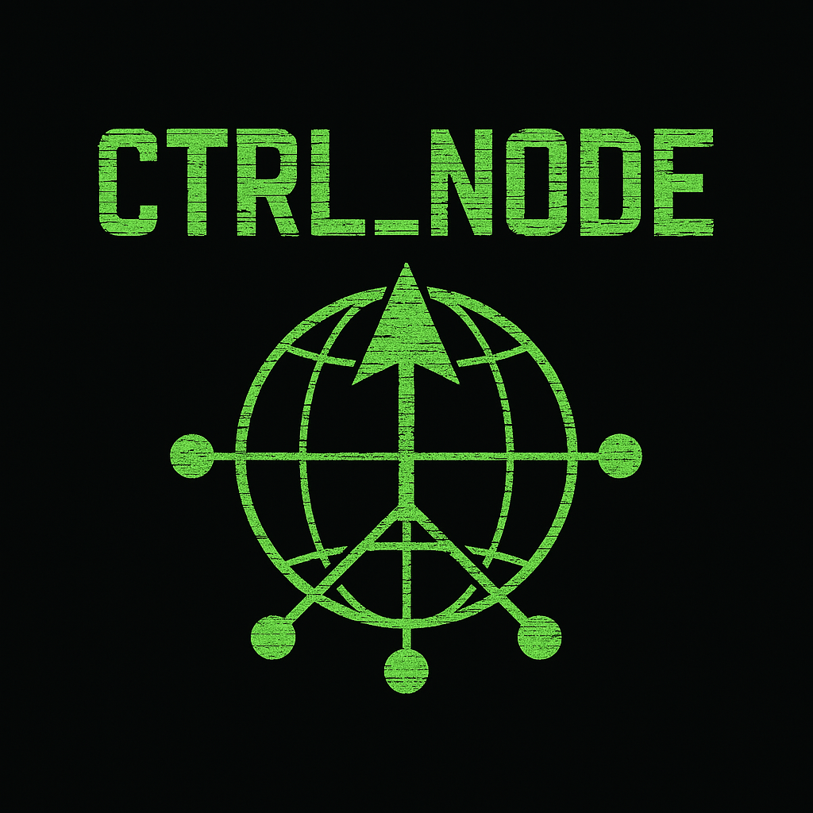

# CTRL_Node

[](https://www.codefactor.io/repository/github/nottherealwallyx/ctrl_node)



Scan the ports of your server or get the DNS records with this small scripts.

## Features

- **Port Scanning**: Scan all ports or common ports of a remote server.
- **DNS Lookup**: Retrieve DNS records such as MX, NS, A, AAAA, SOA, and TXT.
- **Host to IP Conversion**: Convert a hostname to its corresponding IP address.

## Installation

Clone the repository from Github with:

```shell
git clone git@github.com:NotTheRealWallyx/CTRL_Node.git
```

Run the installation script:

```shell
python setup.py install
```

## Requirements

- Python 3.x
- `dnspython` library (automatically installed during setup)

## Usage

Run the application with:

```shell
python -m servertools
```

### Menu Options

1. **Scan Ports**: Choose to scan all ports or common ports of a remote server.
2. **DNS Lookup**: Retrieve DNS records for a given domain.
3. **Host to IP**: Convert a hostname to its IP address.
4. **Show Application Version**: Display the current version of the application.
5. **Exit**: Close the application.

## Tools used

### Format

To keep the application with a standard we use the following tools:

- [Codacy](https://www.codacy.com)
- [Pylint](https://www.pylint.org)
- [isort](https://timothycrosley.github.io/isort/)
- [Black](https://black.readthedocs.io/en/stable/)

### Versioning

We use [SemVer](http://semver.org/) for versioning.

## Licence

[MIT - Licence](LICENSE)

This program is intended for individuals to test their own equipment for weak security, and the author will take no responsibility if it is put to any other use.
